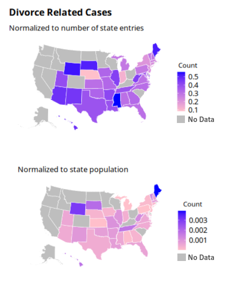

# Divorced From Feelings

*Team Technical Difficulties:* Lily Dao, Reuben Lewis, Maya Sivanandan, Kate McCurley, and Izzie Abilheira

### Research Question

What are common feelings that may create friction in the interaction between the client and the attorney for a divorce-related case?

### Context

Our group was provided data from the American Bar Association with information about attorneys, clients, and the interactions between them. We were particularly interested in the interactions between the attorneys and the clients regarding cases related to divorce due to the high-emotion nature of the topic. We pulled in data from Reddit, specifically r/legaladvice, to gain a better understanding of the tone that users and commenters use on a more informal site vs. with pro bono lawyers with the ABA. We ran the text data from the posts and the conversations through sentiment analysis to understand the common tone of these conversations and how lawyers can approach these conversations for the benefit of the client.

### Data Wrangaling

```{r setup, include=FALSE}
library(tidyverse)
# knitr options
knitr::opts_chunk$set(echo = TRUE)
library(lubridate)
library(timechange)
library(urbnmapr)
library(urbnthemes)
library(sf)
require(gridExtra)
set_urbn_defaults(style = "map")

```

```{r read-data}
df_attorneys <- read_csv("./data/attorneys.csv")
df_attorneytimeentries <- read_csv("./data/attorneytimeentries.csv")
df_categories <- read_csv("./data/categories.csv")
df_clients <- read_csv("./data/clients.csv")
df_questionposts <- read_csv("./data/questionposts.csv")
df_questions <- read_csv("./data/questions.csv")
df_statesites <- read_csv("./data/statesites.csv")
df_subcategories <- read_csv("./data/subcategories.csv")
```

```{r zipcode}
df_zip <- read_csv("./uszips.csv") %>%
  rename(PostalCode = zip)
df_zip
```

```{r pop data}
#load population data from the 2019 census

df_pop_in <- read_csv("./data/ACSDT5Y2019.B01003-Data.csv", skip = 1)

df_pop_narrow <- select(df_pop_in, c("Geography", "Geographic Area Name", "Estimate!!Total"))

df_pop_named <-
  df_pop_narrow %>% 
  rename(id = Geography) %>% 
  separate(
    col = `Geographic Area Name`,
    into = c("County", "state"),
    sep = (",") 
  ) %>%
  mutate_if(is.character, str_trim)

# df_pop_named

st_crosswalk <- tibble(state = state.name) %>%
   bind_cols(tibble(abb = state.abb)) %>% 
   bind_rows(tibble(state = "District of Columbia", abb = "DC"))

# st_crosswalk
 
df_population <- right_join(df_pop_named, st_crosswalk, by = "state")
```

```{r attorney data}
#merge attorney data based on the unique identifier for the attorney and state

df_attorney_data <-
  merge(df_attorneys, df_attorneytimeentries, by = c("AttorneyUno", "StateAbbr")) %>%
  subset(select = -c(Id.x, Id.y, CreatedUtc, EnteredOnUtc, TimeEntryUno))

df_attorney_data
```

```{r question data}
#merge question data based on the unique identifier for the question and state

df_question_data <-
  merge(df_questions, df_questionposts, by = c("QuestionUno", "StateAbbr")) %>%
  subset(select = -c(Id.x, Id.y, CategoryUno, SubcategoryUno, TakenOnUtc, ClosedOnUtc, LegalDeadline, CreatedUtc))

df_question_data <-
  df_question_data %>%
  rename(ClientUno = AskedByClientUno)

df_question_data <-
  df_question_data %>%
  rename(AttorneyUno = ClosedByAttorneyUno)

df_question_data
```

```{r categories data}
#merge categories data based on the unique identifier for the categorey and state

df_categories_data <-
  merge(df_categories, df_subcategories, by = c("CategoryUno", "StateAbbr")) %>%
  subset(select = -c(Id.x, Id.y))


df_categories_data
```

```{r client state data}
#merge client data and state sites

df_client_state_data <-
  merge(df_clients, df_statesites, by = c("StateAbbr", "StateName")) %>%
  subset(select = -c(Id.x, Id.y, CreatedUtc))

df_client_state_data
```

```{r full data set}
#merge all dataframes into one 

full_data <-
  merge(df_question_data, df_client_state_data, by = c("ClientUno", "StateAbbr")) %>%
  subset(select = -c(ClientUno, QuestionUno, StateName))

full_data
```

### Data Visualization

We visualized the divorce-related data per state.

```{r echo=FALSE, out.width = "30%", fig.align = "center"}

```

### Preparing Data for Sentiment Analysis

```{r divorce posts}
#Run the section below once to clean the `CreatedUtc` column and change to date/time
# big_data_1_wide <- 
#   big_data_1_wide %>% 
#   mutate(
#     CreatedUtc = if_else(
#       str_detect(CreatedUtc, "^\\d{4}-\\d{2}-\\d{2} \\d{2}:\\d{2}:\\d{2}$"),
#       CreatedUtc,
#       NA_character_
#     ),
#     CreatedUtc = ymd_hms(CreatedUtc)
#   )

client_first_posts <-
  big_data_1_wide %>%
    filter((str_detect(Subcategory, "[Dd]ivorce"))) %>%
    arrange(CreatedUtc) %>%
    group_by(ClientUno) %>%
    slice(1) %>%
    arrange(CreatedUtc) %>%
    select(PostText, ClientUno, CreatedUtc, StateAbbr, AttorneyUno, ClosedByAttorneyUno)
# client_first_posts

client_posts <-
  client_first_posts %>% 
  ungroup() %>% 
  select(PostText)
client_posts

#export data to csv from the first post text from any divorce related subcategory
write.csv(client_posts, './data/firstClientPosts.csv', row.names = FALSE)
```

```{r type of post}
#compiling the of unresolved, unopened, and resolved divorce related posts from the ABA

posts_unresolved <-
  full_data %>%
  filter((str_detect(Subcategory, "[Dd]ivorce"))) %>%
  filter(AttorneyUno != "NULL" & ClosedByAttorneyUno == "NULL") %>% 
  select(PostText)

posts_unopened <-
  full_data %>%
  filter((str_detect(Subcategory, "[Dd]ivorce"))) %>%
  filter(AttorneyUno == "NULL" & ClosedByAttorneyUno == "NULL") %>% 
  select(PostText)

posts_resolved <-
  full_data %>%
  filter((str_detect(Subcategory, "[Dd]ivorce"))) %>%
  filter(AttorneyUno != "NULL" & ClosedByAttorneyUno != "NULL") %>% 
  select(PostText)
  
posts_unresolved
posts_resolved
posts_unopened

#export data to csv to be processed in python
write.csv(posts_unresolved, './posts_unresolved.csv', row.names = FALSE)
write.csv(posts_resolved, './posts_resolved.csv', row.names = FALSE)
write.csv(posts_unopened, './posts_unopened.csv', row.names = FALSE)

```

### Sentiment Analysis

The compiled CSV data of the unresolved, resolved, and unopened divorce-related ABA posts were then used to conduct sentiment analysis in Python. We made two sentiment analyses: one based on the divorce-related Reddit posts and comments from r/legaladvice and the other based on the divorce-related posts and replies from the pro bono lawyers from the ABA.

All of this processing can be found in the 'python-processing' folder.

```{r echo=FALSE, out.width = "30%", fig.align = "center"}
knitr::include_graphics("images/compare_emotions.png")
```

```{r echo=FALSE, out.width = "30%", fig.align = "center"}
knitr::include_graphics("images/overall_emotions.png")
```

### Insights

Through looking at the data provided to us and data from Reddit, we found some interesting trends within the sentiment analysis. One trend we noticed was the language used in correspondence (for both Reddit and ABA divorce cases) had a significant amount of fear detected, more than any other emotion detected (as seen on our slides). The emotion level for fear was between 0.4 and 0.5 on a scale from zero to one. It is important to note that ABA correspondence has more fear than Reddit correspondence and when the attorney comes into play, the fear level increases. Reddit likely does not experience as high levels of fear detected in the speech because of the informality and anonymity of the platform. Also, by the time a client reaches the step of reaching out to a lawyer, their fear level has had time to increase. Knowing this, ABA attorneys should adjust the language they use to be more approachable which would put the client at ease. We would expect this to decrease the fear level and increase the happiness level of ABA correspondence.

```{r echo=FALSE, out.width = "30%", fig.align = "center"}

```

We then chose to look at how the resolution of posts correlates with their emotional score. We had 3 categories of resolution based on whether posts had a \`TakenByAttorneyUno\` and \`ClosedByAttorneyUno\` (resolved), only a \`TakenByAttorneyUno\` (unresolved), or neither (unopened). As shown in our slides, we found that the unopened posts had higher scores in anger and sadness but lower in fear when compared to the other two categories. This could be because a more fearful tone is interpreted to be more urgent, while high anger and sadness can be seen as hysterical or hard to deal with. ABA attorneys could be encouraged to work with emotionally intense questions to reach a larger number of clients. The ABA could also provide more resources to clients on how to engage with the attorneys so that their issues are conveyed clearly and reasonably, and so they can be more likely to receive assistance. A potential option for this is a message template for specific categories or subcategories, so clients can more easily share their situation and attorneys can more easily gain key information. This could also potentially reduce the time needed to resolve issues.

\
